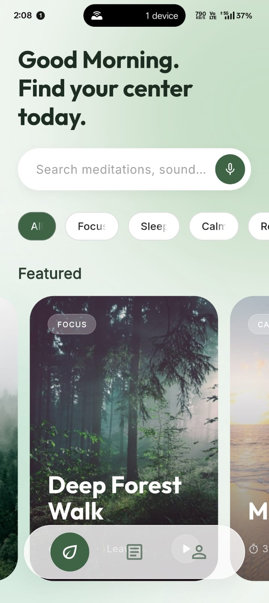
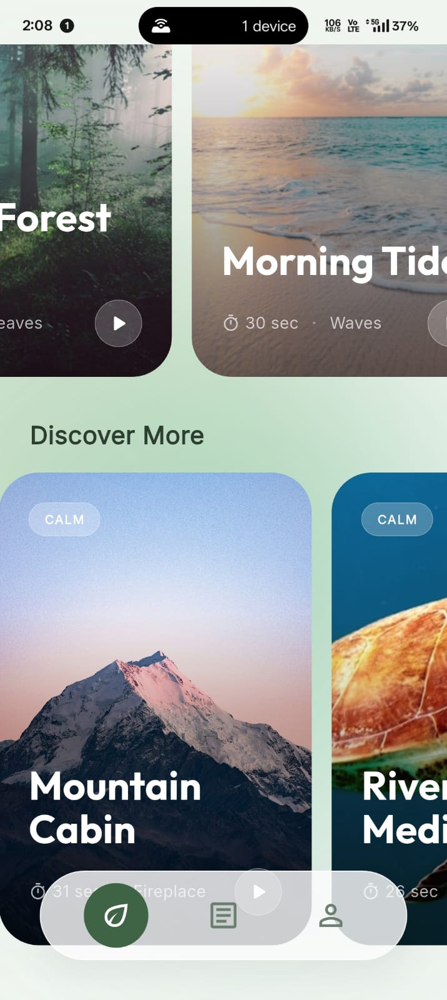
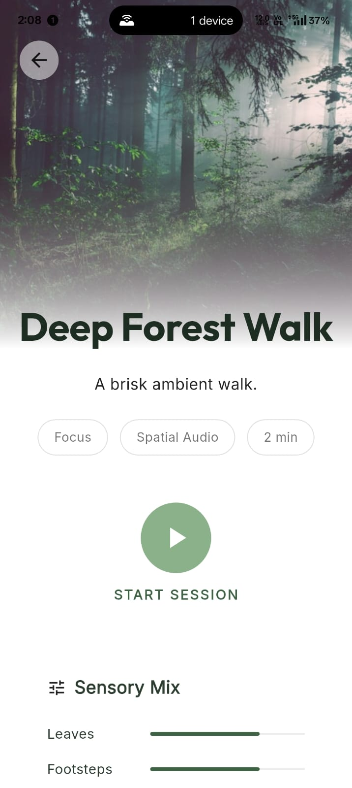
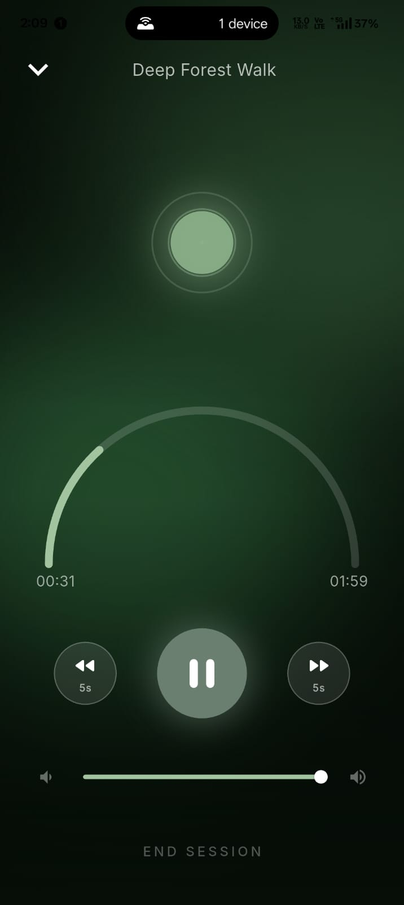
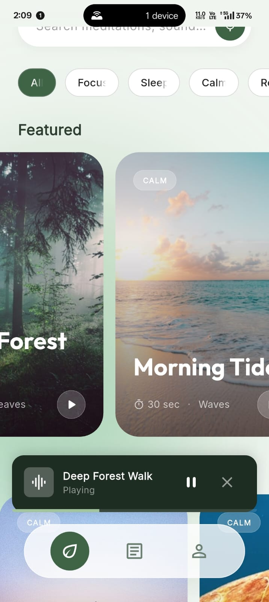
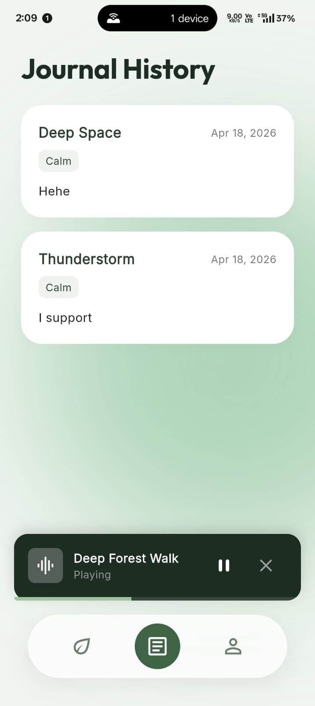

# ArvyaX Flutter Assignment - Ambient Journeys

A minimal, premium experience app that guides users through ambient soundscapes, immersive sessions, and post-session reflection.

| **Main Screen** | **Cards** | **Audio Details** |
| :---: | :---: | :---: |
|  |  |  |

| **Player Session** | **Mini Player** | **journal** |
| :---: | :---: | :---: |
|  |  |  |

## How to Run the Project

1. **Prerequisites**: Ensure you have Flutter stable installed.
2. **Setup**: Navigate to the project root and run:
   ```bash
   flutter pub get
   ```
3. **Launch**: Use `flutter run` on an iOS Simulator, Android Emulator, or a physical device. 

## Architecture Explanation

The application follows a clean **feature-driven architecture**.

### Folder Structure
```text
lib/
├── data/             # Repositories and local models
│   ├── models/       # Models with Hive TypeAdapters (ActiveSession, JournalEntry, Ambience)
│   └── repositories/ # Ambience repository bridging JSON inputs
├── features/         # Feature-first separation
│   ├── ambience/     # Home UI, Filters, and detail screens
│   ├── journal/      # Reflection screens, history tab logic
│   └── player/       # Audio player logic, timer loops, and mini-player widget
└── main.dart         # Entry point, Hive initialization, Global App Theme
```

### State Management Approach
This project leverages **Riverpod** for reactive, decoupled state management:
- `StateNotifierProvider`: Manages the mutation of complex feature states, such as the `PlayerNotifier` controlling timers/audio, and the `JournalNotifier` for caching/saving journaling data.
- `FutureProvider`: Handled asynchronous data loading (fetching local UI configurations).
- `StateProvider`: Driven simple, transient UI reactive states (tag filtering, search inputs).

### Data Flow (Repository → Controller → UI)
1. **Data Layer**: Repositories or raw Hive boxes serve static JSON payloads and read/write local variables.
2. **Controller Layer**: Notifiers encapsulate all business logic. When an action occurs (e.g., completing an audio session), the UI fires a command: `ref.read(playerProvider.notifier).endSession()`.
3. **Presentation Layer**: The UI remains completely declarative. It utilizes `ref.watch(provider)` to blindly observe and reconstruct its layout based on the updated state. 

## Packages Used
- **`flutter_riverpod`**: Chosen for its compile-time safety and decoupled structure. It avoids messy widget-tree injections found in standard Provider.
- **`just_audio`**: Chosen over audio_players for stable audio playback and precise timer looping capabilities.
- **`hive` & `hive_flutter`**: Selected as the persistence medium because of its synchronously-loaded structure and incredible NoSQL read speeds. Hand-written type adapters were used to bypass build_runner overhead.
- **`google_fonts`**: Chosen to implement premium topography (Inter/Outfit mix) rapidly to match Figma without swelling bundle limits.
- **`uuid` & `intl`**: Necessary utilities to format daily journal chronologies securely.

## Bonus Implemented
**Haptic Feedback (Option 4)**: Added subtle physical responses natively triggered via `HapticFeedback.mediumImpact()` and `.selectionClick()` whenever switching moods, and engaging key buttons. This fundamentally achieves the "Apple-like" premium directive on modern devices.

## Tradeoffs & Future Improvements (If I had 2 more days)

1. **Functional Audio Layers**: The "Sensory Mix" sliders currently only act as UI representations. A proper approach involves spinning up multiple `just_audio` isolates or mixing pipelines allowing users to dynamically adjust background "Wind" or "Streams" independently.
2. **Background Lifecycles**: Improve the player to utilize true background activity tracking (like `just_audio_background` integration) ensuring timers don't get starved by iOS/Android OS optimizations when minimized.
3. **Visual Finesse**: Replace the breathing RadialGradient with a genuine GLSL/Fragment shader implementation in Flutter for a higher framerate, complex Glassmorphic animation.
4. **Pagination**: Switch the Hive list retrievals to use lazily-loaded queries to protect RAM if user reflections scale deeply.
